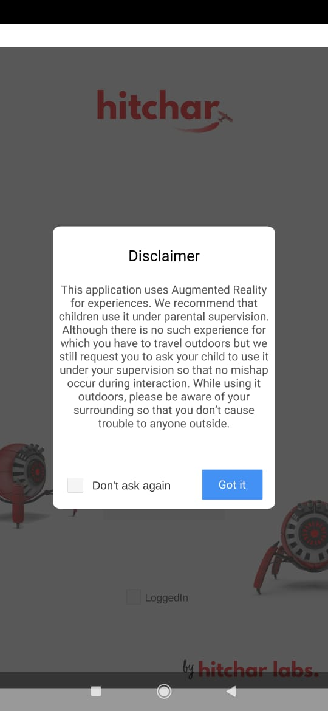
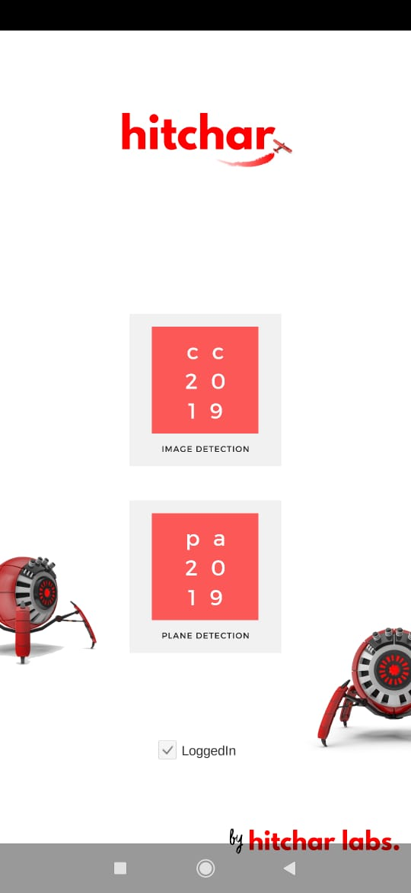
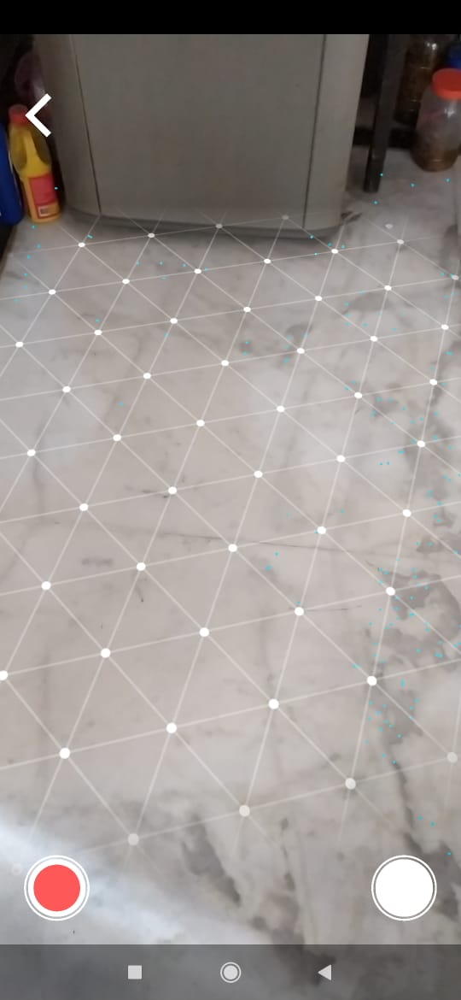
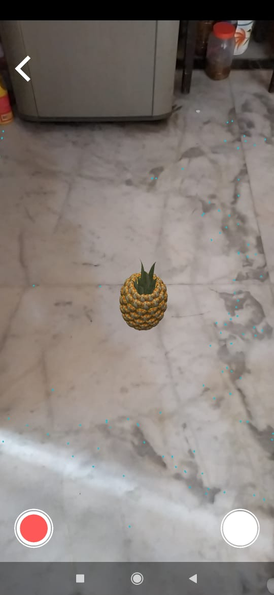
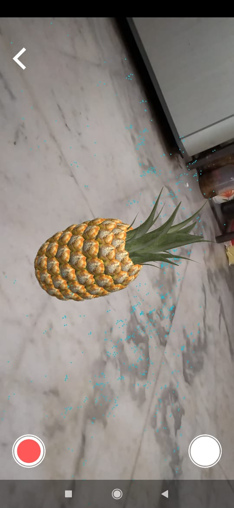

# ExperienceAR
Minimum Android API level: Android 7.0 (API level 24)

Critical Requirement: ARCore Services by GOOGLE

# APK: https://github.com/SKY-ROY/ExperienceAR/blob/master/BUILD/ExperienceAR.apk

# Screenshots:
*Login Screen*

*Register Screen*

*AR-enabled app prompt*

*Content List*

*Plane detection AR session*

 
